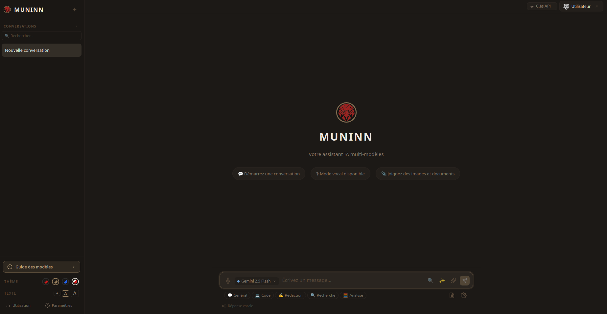
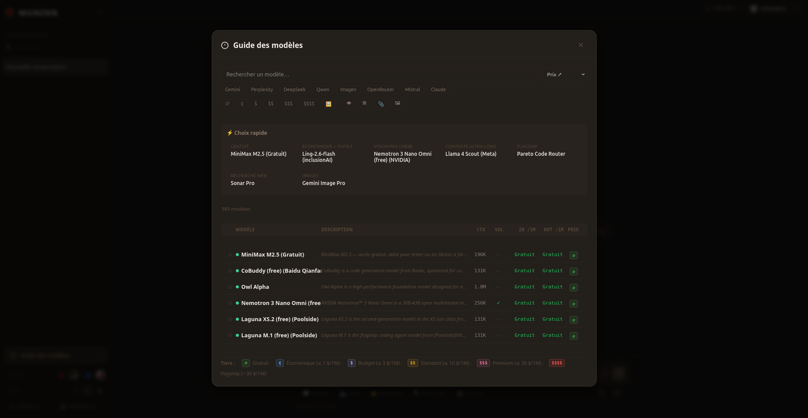
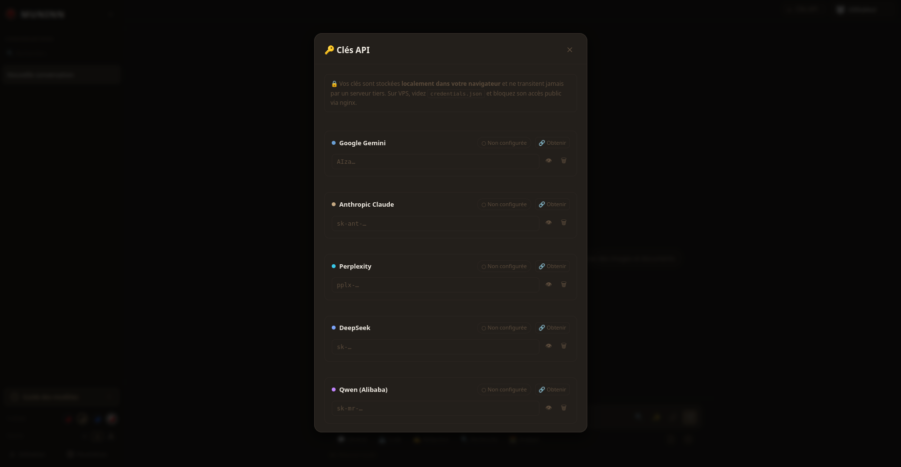

# Muninn

**🇫🇷 Français** · [🇬🇧 English](#muninn-english)

Application web statique multi-modèles LLM (chat, génération d'images, voix),
**100 % côté navigateur** — pas de serveur, pas de build, pas de dépendances à
installer.

> Muninn (« Mémoire »), l'un des deux corbeaux d'Odin avec Huginn. Cette app
> garde vos conversations et préférences en mémoire locale, et fait le pont
> avec une quarantaine de modèles d'IA (plus ~350 modèles OpenRouter chargés
> dynamiquement).

## Aperçu



| Guide des modèles | Clés API |
|---|---|
|  |  |

---

## Sommaire

- [Fonctionnalités](#fonctionnalités)
- [Modes d'utilisation](#modes-dutilisation)
  - [1. En local (recommandé)](#1-en-local-recommandé)
  - [2. Ouverture directe du fichier (`file://`)](#2-ouverture-directe-du-fichier-file)
  - [3. Sur un VPS / hébergement statique](#3-sur-un-vps--hébergement-statique)
- [Configuration des clés API](#configuration-des-clés-api)
- [Pré-remplissage des clés (`credentials.json`)](#pré-remplissage-des-clés-credentialsjson)
- [Sécurité — à lire](#sécurité--à-lire)
- [Structure du projet](#structure-du-projet)
- [Tests](#tests)
- [Dépendances externes (CDN)](#dépendances-externes-cdn)
- [Licence](#licence)

---

## Fonctionnalités

- **Multi-provider** : Google Gemini, Anthropic Claude, Mistral, DeepSeek,
  Qwen, Perplexity (Sonar) et OpenRouter — streaming SSE natif depuis le
  navigateur, sans backend.
- **Gestion des clés API** : modal dédié avec **validation live** de chaque
  clé (✓ valide / ✗ refusée / ⏳ en test), liens directs « Obtenir une clé »
  vers la console de chaque fournisseur, et indicateur global d'état.
- **Catalogue de modèles dynamique** : ~40 modèles intégrés + ~350 modèles
  OpenRouter récupérés en direct depuis l'API publique (cache 5 min,
  rafraîchissement automatique). Badges de tarif (`∅ ¢ $ $$ $$$ $$$$`).
- **Guide des modèles** : listing filtrable (recherche, provider, tarif,
  capacités), triable (prix / contexte / nom), avec « Choix rapide » calculé
  et favoris.
- **Favoris** : jusqu'à 5 modèles épinglés, accès rapide en tête du sélecteur
  de chat, synchronisés avec le guide (par utilisateur).
- **Génération d'images** : Imagen, FLUX, Ideogram, Recraft, Seedream.
- **Voix** : reconnaissance vocale (STT) et synthèse (TTS) via Web Speech API
  (fr-FR).
- **Recherche web** intégrée via les modèles Sonar de Perplexity.
- **Pièces jointes** : images et fichiers selon les capacités du modèle.
- **Multi-utilisateurs** locaux, données cloisonnées par profil
  (conversations, favoris, skills). Avatar : emoji **ou photo depuis une URL**.
- **Organisation** : dossiers, étiquettes, snippets, skills configurables
  (Code, Rédaction, Recherche, Analyse).
- **Suivi du budget** (limites quotidienne / hebdo / mensuelle).
- **Robustesse** : auto-troncation du contexte en cas de dépassement, retry
  exponentiel sur 429, messages d'erreur typés (401/402/404/5xx), extraction
  des blocs `<think>`.
- **4 thèmes** : Dark Scarlet, Dark Bronze, Daltonien (accessible), Clair —
  + 3 tailles de texte.

---

## Modes d'utilisation

L'app est un ensemble de fichiers statiques. Trois façons de la lancer.

### 1. En local (recommandé)

Servez le dossier avec n'importe quel serveur HTTP statique :

```bash
python3 -m http.server 8000
# puis ouvrir http://localhost:8000
```

Autres équivalents : `npx serve`, `php -S localhost:8000`, l'extension
« Live Server » de VS Code, etc. C'est la méthode la plus fiable (comportement
identique à un déploiement réel).

### 2. Ouverture directe du fichier (`file://`)

Double-cliquer `index.html` fonctionne dans la plupart des cas (les scripts
sont des scripts classiques, et les API qui autorisent le CORS `*` répondent
même depuis l'origine `null`).

⚠️ Limites connues du mode `file://` :
- `credentials.json` n'est pas chargé (sans incidence, l'app reste
  fonctionnelle).
- Certains navigateurs (Chrome notamment) sont stricts en `file://`
  (localStorage partagé entre fichiers locaux, quelques requêtes bloquées).

→ En cas de comportement étrange, préférez la méthode 1.

### 3. Sur un VPS / hébergement statique

Comme c'est du statique pur, **n'importe quel serveur de fichiers convient**
(nginx, Caddy, Apache, GitHub Pages, Netlify…). Aucun backend requis.

**Deux règles de sécurité non négociables :**

1. **Ne déposez jamais un `credentials.json` rempli** sur un hébergement
   public : il serait téléchargeable par tout le monde
   (`https://votre-domaine/credentials.json`) → fuite des clés. Soit vous ne
   le mettez pas du tout (chacun saisit ses clés via l'UI), soit vous bloquez
   son accès côté serveur.
2. **Servez en HTTPS.**

Exemple avec **Caddy** (HTTPS automatique via Let's Encrypt) :

```caddy
votre-domaine.fr {
    root * /var/www/muninn
    file_server
    @creds path /credentials.json
    respond @creds 404      # bloque l'accès au fichier de clés
}
```

Exemple avec **nginx** :

```nginx
server {
    listen 443 ssl;
    server_name votre-domaine.fr;
    root /var/www/muninn;
    index index.html;

    location = /credentials.json { deny all; return 404; }
}
```

---

## Configuration des clés API

Au premier lancement, ouvrez le modal **🔑 Clés API** (barre du haut) et
collez les clés des fournisseurs que vous souhaitez utiliser. Chaque carte :

- valide la clé en direct (✓ / ✗ / ⏳) ;
- propose un lien **« 🔗 Obtenir une clé »** vers la console du fournisseur ;
- permet de masquer / supprimer la clé.

Vous pouvez n'en configurer qu'une seule pour commencer — seuls les modèles
des fournisseurs configurés seront utilisables.

Vous pouvez aussi ajouter un **provider personnalisé** (tout endpoint
compatible OpenAI : OpenAI, Ollama, LM Studio…) dans le même modal.

## Pré-remplissage des clés (`credentials.json`)

Pour un usage **local uniquement**, vous pouvez créer un `credentials.json` à
la racine pour pré-remplir les clés au premier lancement :

```json
{
  "gemini": "AIza...",
  "anthropic": "sk-ant-...",
  "perplexity": "pplx-...",
  "deepseek": "sk-...",
  "qwen": "sk-...",
  "openrouter": "sk-or-...",
  "mistral": "..."
}
```

Ce fichier est **ignoré par git** (`.gitignore`) et **ne doit jamais être
déposé sur un hébergement public** (voir la section VPS). Les clés sont
ensuite copiées dans le `localStorage` du navigateur ; vider/supprimer le
fichier n'efface pas les clés déjà importées.

---

## Sécurité — à lire

- Les clés API sont stockées en **clair dans le `localStorage`** du
  navigateur. C'est un choix d'architecture (app sans serveur). Utilisez
  Muninn **sur un appareil de confiance**.
- Les requêtes partent **directement** de votre navigateur vers les API des
  fournisseurs — aucune donnée ne transite par un serveur tiers.
- Données **cloisonnées par utilisateur** (conversations, favoris, skills) via
  des clés `localStorage` suffixées par l'identifiant du profil.
- Ne déployez pas une instance publique avec un `credentials.json` rempli.

---

## Structure du projet

```
.
├── index.html          # Shell UI complet
├── css/
│   ├── themes.css      # Variables des 4 thèmes
│   └── app.css         # Styles application
├── js/
│   ├── config.js       # Catalogue de modèles intégrés + endpoints + helpers (tier…)
│   ├── storage.js      # Persistance localStorage (par utilisateur) + migrations
│   ├── providers.js    # Registre des providers + validation live des clés
│   ├── catalog.js      # Catalogue dynamique (fetch live OpenRouter + cache)
│   ├── api.js          # Couche multi-provider + streaming SSE + gestion d'erreurs
│   ├── speech.js       # STT / TTS via Web Speech API
│   └── app.js          # Contrôleur UI principal
├── tests/
│   └── run.js          # Tests (Node pur, sans dépendance)
├── assets/             # Logos et images
├── package.json        # Métadonnées + script de test (pas de dépendances)
└── CHANGELOG.md
```

## Tests

Logique métier du catalogue couverte par un harnais Node sans dépendance :

```bash
npm test          # ou : node tests/run.js
```

## Dépendances externes (CDN)

- [marked](https://github.com/markedjs/marked) — rendu Markdown
- [highlight.js](https://highlightjs.org/) — coloration syntaxique

Le catalogue de modèles utilise aussi l'API publique
`https://openrouter.ai/api/v1/models` (sans clé) pour se tenir à jour.

## Licence

Distribué sous licence **MIT** — voir [LICENSE](LICENSE).

<br>

---
---

<br>

# Muninn (English)

**🇬🇧 English** · [🇫🇷 Français](#muninn)

Static, multi-model LLM web app (chat, image generation, voice),
**100% client-side** — no server, no build step, nothing to install.

> Muninn ("Memory"), one of Odin's two ravens alongside Huginn. The app keeps
> your conversations and preferences in local storage and bridges to around
> forty AI models (plus ~350 OpenRouter models loaded dynamically).

## Preview


| Model guide | API keys |
|---|---|
|  |  |

---

## Table of contents

- [Features](#features)
- [Usage modes](#usage-modes)
  - [1. Locally (recommended)](#1-locally-recommended)
  - [2. Opening the file directly (`file://`)](#2-opening-the-file-directly-file)
  - [3. On a VPS / static hosting](#3-on-a-vps--static-hosting)
- [Configuring API keys](#configuring-api-keys)
- [Pre-filling keys (`credentials.json`)](#pre-filling-keys-credentialsjson)
- [Security — please read](#security--please-read)
- [Project structure](#project-structure)
- [Tests](#tests-1)
- [External dependencies (CDN)](#external-dependencies-cdn)
- [License](#license)

---

## Features

- **Multi-provider**: Google Gemini, Anthropic Claude, Mistral, DeepSeek,
  Qwen, Perplexity (Sonar) and OpenRouter — native SSE streaming from the
  browser, no backend.
- **API key management**: dedicated modal with **live validation** of each key
  (✓ valid / ✗ rejected / ⏳ testing), direct "Get a key" links to each
  provider's console, and a global status indicator.
- **Dynamic model catalog**: ~40 built-in models + ~350 OpenRouter models
  fetched live from the public API (5-min cache, auto-refresh). Pricing tier
  badges (`∅ ¢ $ $$ $$$ $$$$`).
- **Model guide**: filterable listing (search, provider, price, capabilities),
  sortable (price / context / name), with computed "Quick picks" and
  favorites.
- **Favorites**: up to 5 pinned models, quick access at the top of the chat
  selector, synced with the guide (per user).
- **Image generation**: Imagen, FLUX, Ideogram, Recraft, Seedream.
- **Voice**: speech-to-text (STT) and text-to-speech (TTS) via the Web Speech
  API (fr-FR).
- **Web search** built in via Perplexity's Sonar models.
- **Attachments**: images and files depending on the model's capabilities.
- **Local multi-user**, with data partitioned per profile (conversations,
  favorites, skills). Avatar: emoji **or a photo from a URL**.
- **Organization**: folders, tags, snippets, configurable skills (Code,
  Writing, Research, Analysis).
- **Budget tracking** (daily / weekly / monthly limits).
- **Robustness**: automatic context truncation on overflow, exponential
  backoff on 429, typed error messages (401/402/404/5xx), `<think>` block
  extraction.
- **4 themes**: Dark Scarlet, Dark Bronze, Color-blind (accessible), Light —
  plus 3 text sizes.

---

## Usage modes

The app is a set of static files. Three ways to run it.

### 1. Locally (recommended)

Serve the folder with any static HTTP server:

```bash
python3 -m http.server 8000
# then open http://localhost:8000
```

Equivalents: `npx serve`, `php -S localhost:8000`, the VS Code "Live Server"
extension, etc. This is the most reliable method (behaves exactly like a real
deployment).

### 2. Opening the file directly (`file://`)

Double-clicking `index.html` works in most cases (the scripts are classic
scripts, and APIs that allow CORS `*` respond even from the `null` origin).

⚠️ Known limitations of `file://` mode:
- `credentials.json` is not loaded (harmless — the app still works).
- Some browsers (notably Chrome) are strict in `file://` (localStorage shared
  across local files, some requests blocked).

→ If anything behaves oddly, prefer method 1.

### 3. On a VPS / static hosting

Since it's pure static, **any file server works** (nginx, Caddy, Apache,
GitHub Pages, Netlify…). No backend required.

**Two non-negotiable security rules:**

1. **Never deploy a filled-in `credentials.json`** on public hosting: it would
   be downloadable by anyone (`https://your-domain/credentials.json`) → key
   leak. Either don't ship it at all (each user enters their keys via the UI),
   or block access to it on the server.
2. **Serve over HTTPS.**

Example with **Caddy** (automatic HTTPS via Let's Encrypt):

```caddy
your-domain.com {
    root * /var/www/muninn
    file_server
    @creds path /credentials.json
    respond @creds 404      # block access to the keys file
}
```

Example with **nginx**:

```nginx
server {
    listen 443 ssl;
    server_name your-domain.com;
    root /var/www/muninn;
    index index.html;

    location = /credentials.json { deny all; return 404; }
}
```

---

## Configuring API keys

On first launch, open the **🔑 API Keys** modal (top bar) and paste the keys of
the providers you want to use. Each card:

- validates the key live (✓ / ✗ / ⏳);
- offers a **"🔗 Get a key"** link to the provider's console;
- lets you hide / delete the key.

You can configure just one to start — only models from configured providers
will be usable.

You can also add a **custom provider** (any OpenAI-compatible endpoint: OpenAI,
Ollama, LM Studio…) in the same modal.

## Pre-filling keys (`credentials.json`)

For **local use only**, you can create a `credentials.json` at the root to
pre-fill keys on first launch:

```json
{
  "gemini": "AIza...",
  "anthropic": "sk-ant-...",
  "perplexity": "pplx-...",
  "deepseek": "sk-...",
  "qwen": "sk-...",
  "openrouter": "sk-or-...",
  "mistral": "..."
}
```

This file is **git-ignored** (`.gitignore`) and **must never be deployed to
public hosting** (see the VPS section). The keys are then copied into the
browser's `localStorage`; emptying/deleting the file does not remove keys that
were already imported.

---

## Security — please read

- API keys are stored in **plain text in the browser's `localStorage`**. This
  is an architectural choice (serverless app). Use Muninn **on a trusted
  device**.
- Requests go **directly** from your browser to the providers' APIs — no data
  passes through any third-party server.
- Data is **partitioned per user** (conversations, favorites, skills) via
  `localStorage` keys suffixed with the profile id.
- Do not deploy a public instance with a filled-in `credentials.json`.

---

## Project structure

```
.
├── index.html          # Full UI shell
├── css/
│   ├── themes.css      # Variables for the 4 themes
│   └── app.css         # Application styles
├── js/
│   ├── config.js       # Built-in model catalog + endpoints + helpers (tier…)
│   ├── storage.js      # localStorage persistence (per user) + migrations
│   ├── providers.js    # Provider registry + live key validation
│   ├── catalog.js      # Dynamic catalog (live OpenRouter fetch + cache)
│   ├── api.js          # Multi-provider layer + SSE streaming + error handling
│   ├── speech.js       # STT / TTS via the Web Speech API
│   └── app.js          # Main UI controller
├── tests/
│   └── run.js          # Tests (pure Node, no dependencies)
├── assets/             # Logos and images
├── package.json        # Metadata + test script (no dependencies)
└── CHANGELOG.md
```

## Tests

The catalog's business logic is covered by a dependency-free Node harness:

```bash
npm test          # or: node tests/run.js
```

## External dependencies (CDN)

- [marked](https://github.com/markedjs/marked) — Markdown rendering
- [highlight.js](https://highlightjs.org/) — syntax highlighting

The model catalog also uses the public API
`https://openrouter.ai/api/v1/models` (no key) to stay up to date.

## License

Released under the **MIT** license — see [LICENSE](LICENSE).
